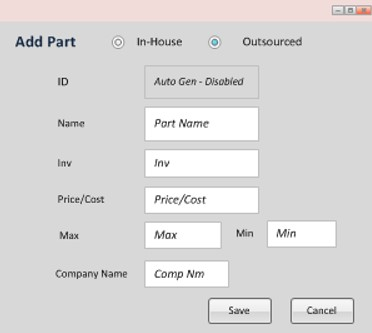

# Inventory Management System's GUI Mock-up

## A. Main screen 

 

 

## B. “Add Part” screen
The user has the option to select “In-House” or “Outsourced” to categorize the part.  If the user selects “Outsourced,” the “Company Name” field is available.
The field “Inv” stores the number of units of the product that the company currently have available. The field “Min” stores the requirement for the minimum number of product items that must be available by the company at any given moment in time, and the field “Max” denotes the maximum number of product items that the company can store. The values of the filed “Inv,” therefore, must be an integer between the values stored in the field “Min” and “Max.” 
 

 
If the user selects “In-House,” the “Machine ID” field is available.
 

 

 

## C. Modify Part 
The user has the option to select “In-House” or “Outsourced” to categorize the part.  If the user selects “Outsourced,” the “Company Name” field is available.  The “Modify Part” screen has the same functionality as the “Add Part” screen, but the fields are populated with data that was previously entered and saved.
 

 
If the user selects “In-House,” the “Machine ID” field is available.
 

 

 

## D. Add Product

 

## E. Modify Product
The “Modify Product” screen has the same functionality as the “Add Product” screen, but the parts and fields are populated with data that was previously entered and saved.
 

 
